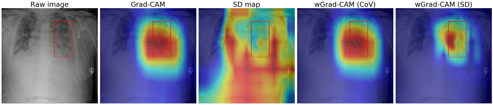
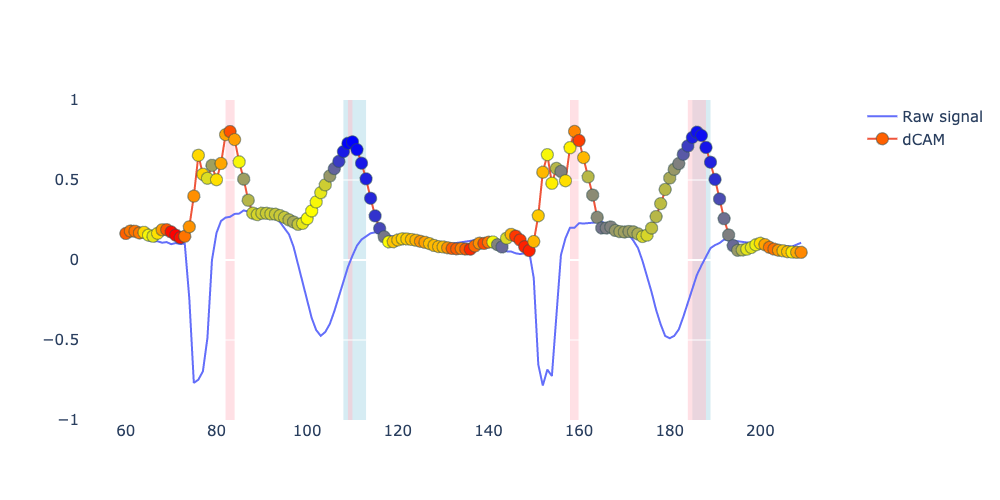

### Improvement of class activation mapping \\by introducing uncertainty for medical application

We implemented a simple method to reflect the uncertainty in CAM by weighting the sampled CAMs by the uncertainty
measures assessed by performing Monte Carlo dropout. We implemented gradient-based class activation mapping (Grad-CAM) and score-based class activation mapping (Score-CAM). Jupyter notebooks are for reproducing the visualization involving the general image classification using EfficientNetB0.

- models: directory storing models.
- weights: directory storing model weights.
	- best_weights_ECG.h5 (for 1DCNN model)
- images: directory storing the numpy array of tested images (resized to 224 x 224) and the resulting figure.

#### The dataset used:
- [PTB-XL](https://physionet.org/content/ptb-xl/)
- [Chest-Xray14](https://nihcc.app.box.com/v/ChestXray-NIHCC) (with the annotation provided by RSNA)
- [ImageNet](https://image-net.org/)

#### 2DCNN
Using Monte Carlo dropout to improve the localization performance of Grad-CAM and Score-CAM.

##### Standard CNN with MC dropout

#### 1DCNN
Improved explainability of classification of electrocardiogram using Score-CAM and Bayesian CNN.
The blue point indicates the CAM with high confidence, while red indicates low confidence. The pink background indicates CAM aboe 90th percentile of all CAM, and the green background indicates CAM below 10th percentile of all coefficient of variance.
