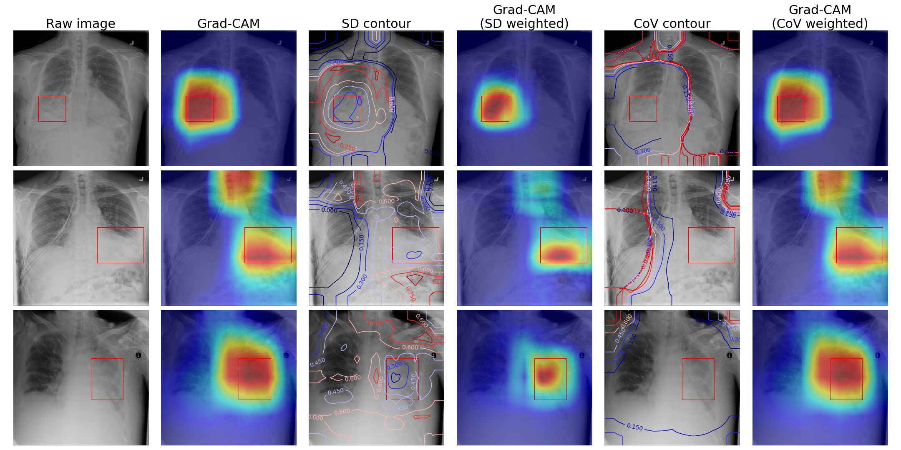
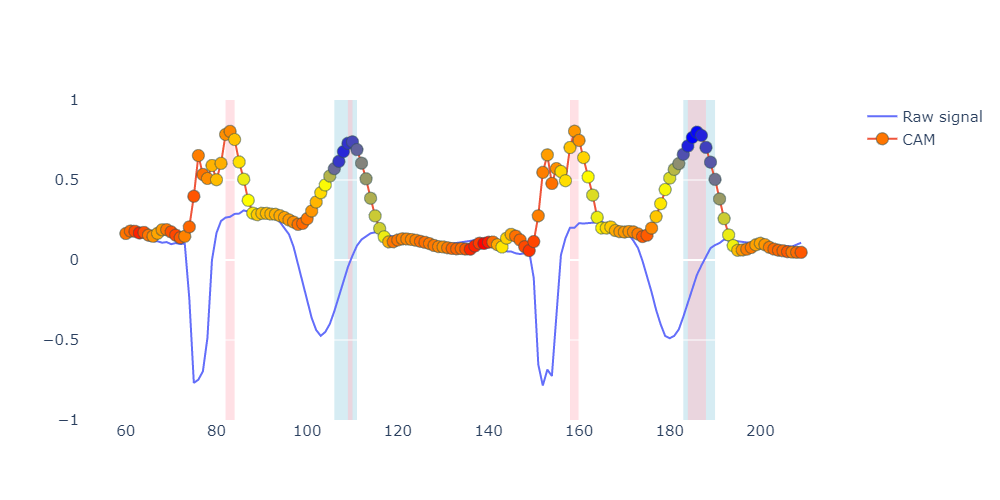

### Introducing uncertainty to class activation mapping in convolutional neural networks
#### 2DCNN
Using Monte-Carlo dropout to improve the localization performance of Grad-CAM and Score-CAM.

##### Standard CNN with MC dropout

#### 1DCNN
Improved explainability of classification of ECG using Score-CAM and Bayesian CNN.
The blue point indicates the CAM with high confidence (lower CoV), while red indicates low confidence (higher CoV). The pink background indicates CAM aboe 90th percentile of all CAM, and the green background indicates CAM below 10th percentile of all CoV.
